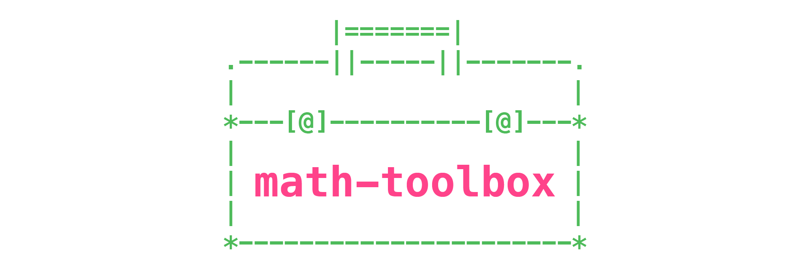

# [](https://github.com/terkelg/math-toolbox)

> Lightweight and modular collection of JS math functions

[](http://standardjs.com/)
[](https://travis-ci.org/terkelg/math-toolbox)
[](https://coveralls.io/github/terkelg/math-toolbox?branch=master)
[](https://david-dm.org/terkelg/math-toolbox?type=dev)
[](https://github.com/semantic-release/semantic-release)
[](https://www.npmjs.com/package/math-toolbox)


## Install

### Node
math-toolbox works in both node.js and browser environments. For node, install with npm:
```
npm install math-toolbox --save-dev
```


## Usage
You can import indivisual files
```js
import { clamp, map } from 'math-toolbox'
```

or the entire package
```js
import * as MathToolbox from 'math-toolbox'
```


### Browser
To use in browser, grab the ```math-toolbox.umd.min.js``` file and add it to your page, or use the CDN:
```
https://unpkg.com/math-toolbox/dist/math-toolbox.umd.min.js
```


## Documentation
**See full documentation here:**

**https://terkelg.github.io/math-toolbox/**


### Functions

| function | Description |
| ---------|:------------|
| clamp | Clamps a value between a minimum and maximum value and returns clamped value. |
| lerp | Linear interpolation between two values. |
| map | Re-maps a number from one range to another. |
| normalize | Normalize a value between two bounds. |
| wrap | Ensures that the value always stays between min and max, by wrapping the value around. |
| smoothStep | Smooth a value. |
| diagonal | Return diagonal of a rectangle. |
| isPowerOfTwo | Checks if a number is a power of two. |
| randomInt | Return random int within given range. |
| randomFloat | Return random float with given percision and range. |
| distance | Returns the euclidian distance between the two given set of coordinates. |
| parabola | Remap value to parabola. |
| radToDeg | Radians to degrees. |
| degToRad | Degrees to radians. |
| closestPowerOfTwo | Returns the closest power of two value.|
| fuzzyEqual | Two numbers are fuzzyEqual if their difference is less than epsilon. |
| fuzzyCeil | Calculates a fuzzy ceil to the given value. |
| fuzzyFloor | Calculates a fuzzy floor to the given value. |
| fuzzyGreaterThan | A is fuzzyGreaterThan B if it is more than B - epsilon. |
| fuzzyLessThan | A is fuzzyLessThan B if it is less than B + epsilon. |
| maxAdd | Adds, but never lets the value go over the specified maximum. |
| minSub | Subtracts, but never lets the value go below the specified minimum. |
| average | Return the average of all values passed to the function. |

## Plans
See GitHub Wiki:
https://github.com/terkelg/math-toolbox/wiki


## Build
First clone the project from github:
```
git clone git://github.com/terkelg/math-toolbox.git
cd math-toolbox
```

Install the project dependencies:
```
npm install
```

Then, the project can be build by executing the build script via NPM:
```
npm run build
```

Build and uglify with:
```
npm run build:uglify
```


## Test
[Jest](https://github.com/facebook/jest) is used for unit testing. Test with:
```
npm test
```

To watch for changes and test use:

```
npm test:watch
```

Get code coverage with
```
npm test:coverage
```


## Authors
- [Patrick Heng](https://github.com/patrickheng)
- [Fabien Motte](https://github.com/FabienMotte)
- [Terkel Gjervig](https://github.com/terkelg)


## License
*MIT @ Terkel Gjervig*
